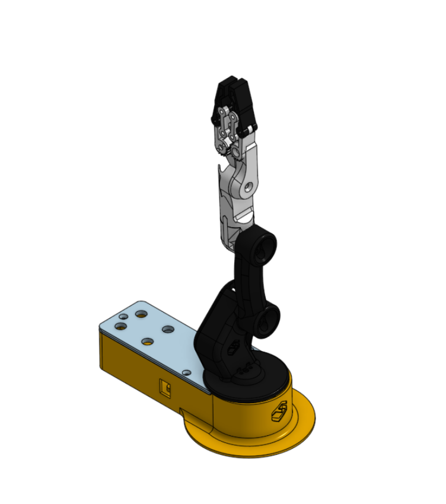
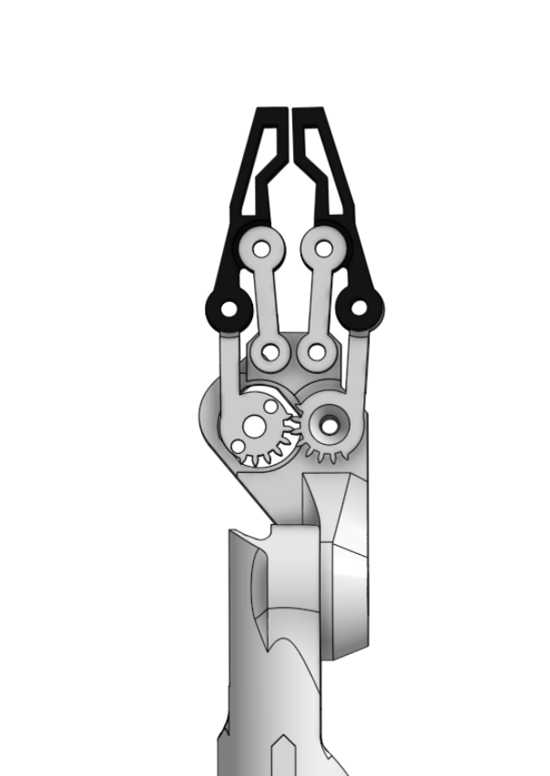
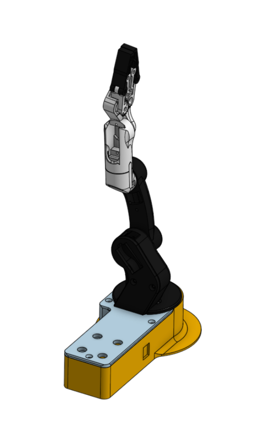

# Robot Arm Assembly

This repository contains the mechanical design of a **robotic arm with a gripper**, modeled and assembled as a complete system. The design focuses on **joint articulation**, **servo-driven motion**, and a compact structure suitable for robotics prototyping.

---

## Project Overview

The robot arm consists of:
- A stable base
- Multiple articulated joints
- An end-effector gripper with a gear-driven mechanism

The arm is designed to demonstrate **mechanical motion**, **rotational joints**, and **gripping functionality**, making it suitable for learning and experimentation in robotics and automation.

---

## Design Features

- **Multi-joint articulated arm**  
  Enables rotational movement at different levels of the arm
- **Gear-based gripper mechanism**  
  Ensures synchronized opening and closing of the gripper
- **Compact base design**  
  Provides stability while supporting arm motion
- **Servo-ready structure**  
  Joints are designed to accommodate servo motors for actuation

---

## Design Preview

### Full Assembly View

### Gripper Mechanism (Close-Up)

### Side / Alternate View

---

## Files Included

- `Robot Arm Assembly.stl` — Complete robot arm assembly model
- Images documenting the assembly and gripper mechanism

---

## Notes

This robot arm design was created as part of hands-on robotics training, with a focus on:
- Mechanical assembly
- Motion through joints
- Understanding gripper mechanisms and gear synchronization

Possible future improvements include:
- Defining motion limits for joints
- Weight optimization for 3D printing
- Integration with a robotic base for full system operation
